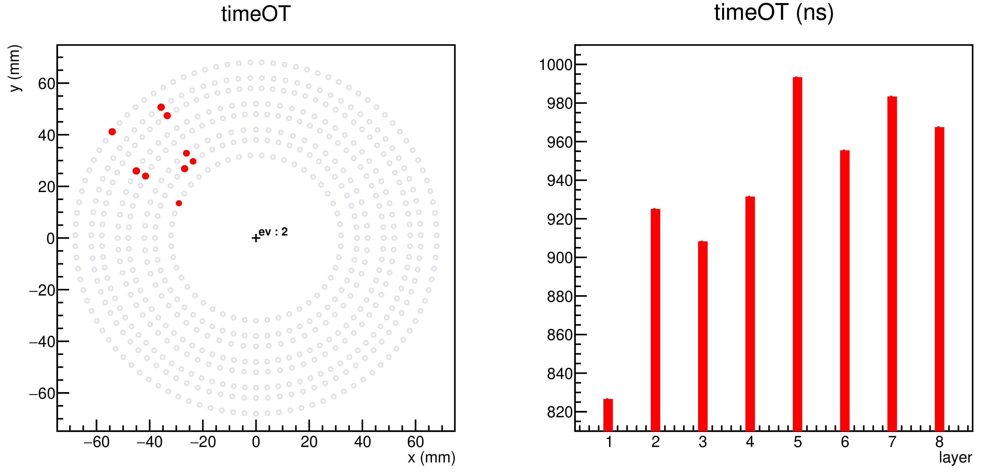

# README

Executables

	1. simpleTest.cpp (test of hipoExtractor.h)

	1. corrTimeAmp.cpp (study the correlation between the time resolution and adcMax)

	1. histAhdcAdc.cpp (from hipo file / AHDC::wf:136 bank to histogram)

	1. ahdcView.cpp (test of AhdcGeom.h)

	1. color.cpp 

	1. monitor.cpp

The description is given in each file. 

## simpleTest (decoding)

## corrTimeAmp

## histAhdcAdc

## ahdcView

## color

## monitor 

