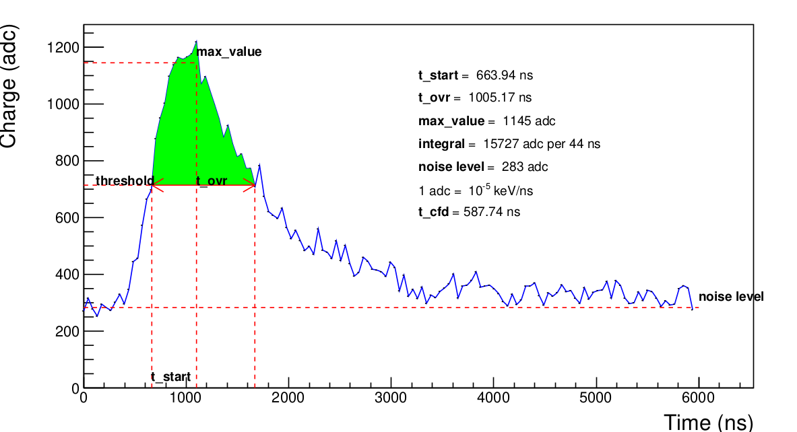

# AHDC signal

The process to obtain this signal is well explained in [Preparation of the ALERT experiment at Jefferson Lab (chapter 4)](https://ftouchte.github.io/projects/). Here is a simulation of the AHDC signal.  This section presents the definition of each decoding output.

## max_value 

This the amplitude of the signal. It is important to note that at this stage we only have a digitized signal. A way to extract a precise value of this amplitude is to do a Gaussian fit using 5 or more points around the sample maximum and theoretically determine the maximum of this Gaussian. However, this decoding algorithm needs to be very fast, whereas fits usually take a long time. We have do it simple : the amplitude is simply the average of the 5 samples around the sample maximum. Actually, it may appears that the signal is saturated like in the figure bellow. In that case, the amplitude corresponds to the `adc_max` but the moment when the signal reach it is the middle of the plateau.

## noise_level 

Also called pedestal, it gives an indication the mean value of the noise. As we can't predict the noise, for the moment, we're using an average of the first five samples.

## threshold 

This is the half of the amplitude after removing the noise level. It is used to determine `t_start` and `t_ovr`.

## t_start 

This is the moment when the signal reaches the half of its amplitude. Because of the fluctuation due to the noise, we agree that it corresponds to the last past below the threshold and before `max_value`. As the time is also sampled, we cannot expect `t_start` having the form `t_min + i*samplingTime`. Instead, it exists `i` such as \\(t_i < t_{start} < t_{i+1}\\). If \\(S_i\\) is the value of the signal at \\(t_i\\), approximating the signal by a straight line gives the equation :

\\[
    y = \frac{S_{i+1} - S_i}{t_{i+1}-t_i} (t - t_i) + S_i := \mbox{slope}*(t - t_i) + S_i
\\]

When \\(y = \mbox{threshold}\\), \\(t = t_{start}\\). Hence :

\\[    
    t_{start} = t_i + \frac{\mbox{threshold} - S_i}{\mbox{slope}} 
\\]
    

## t_ovr 

This is the time minus `t_start` when the signal falls below the threshold after having reached its maximum value. Because of the fluctuation due to the noise, we agree that it corresponds to the first pass below the threshold and after `max_value`. It is determined in the same way that `t_start`. 

## integral 

This is the green area shown in the figure [SignalDecoded](#ahdc-signal). It is equals to the sum of all bins (samples) between `t_start` and `t_ovr`. 

## t_cfd 

This is the time obtained using the Constant Fraction Discriminator (CFD) algorithm. The CFD has the particularity of giving the time when the signal reaches a constant fraction of its amplitude. The process to determine this time is illustrated by the figure bellow. The CFD depends on two parameters : a fraction factor and a delay. Currently, the fraction factor is set to $0.3$ and the delay to 5 (in index units) but they have to be optimized ! 

N.B : This image has been taken from [EDINBURGH INSTRUMENTS](https://www.edinst.com/blog/constant-fraction-discrimination/).

## Decoding output vs AHDC::adc entries

| AHDC::adc entries | Decoding output |
|-|-|
|ADC|max_value|
|time|t_ovr|
|ped|noise_level|
|integral|integral|
timestamp|t_start|
|t_cfd|t_cfd|