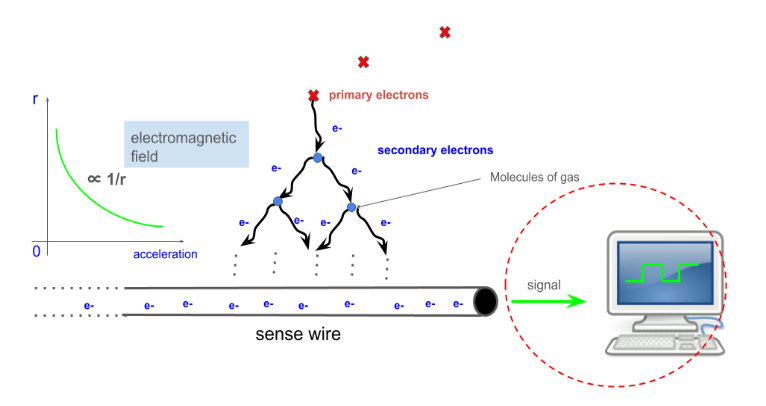
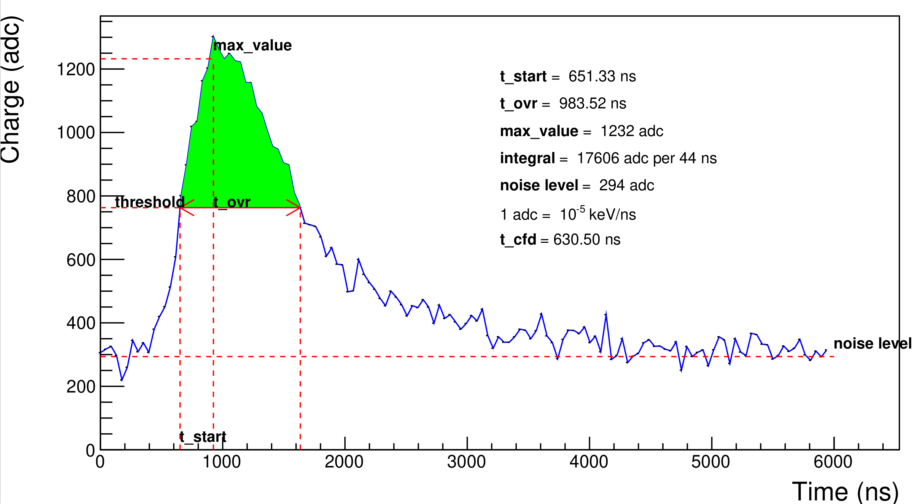

# Introduction

This page is a documentation of my work related to the ALERT software. I work on the simulation of the AHDC signal. A description of the project and the results are accessible in [Preparation of the ALERT experiment at JLab](https://ftouchte.github.io/projects/index.html) (see the project of June 2024). 

The simulation is based on GEMC. The following lines describe the steps to run my code. 

<!--  -->
