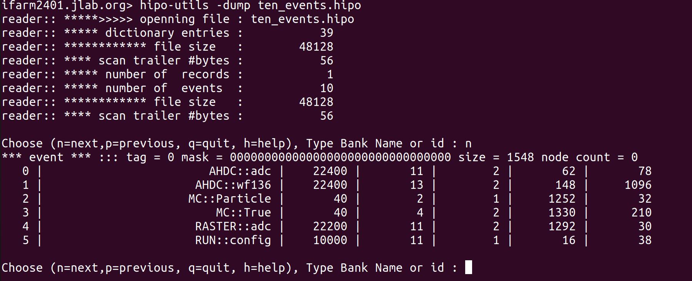
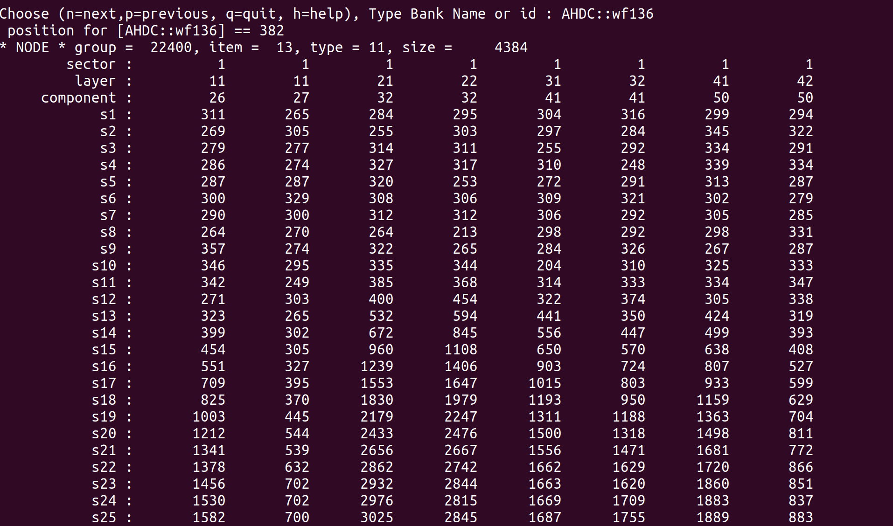

# Creation of the AHDC::wf136 bank?

I wanted to create a new bank to save the digitized AHDC signal. I called it `AHDC::wf136`. wf refers "waveform" and 136 is the sampling number. (It is important to note that 136 is an abitrary number that should normally depends on `(int) (tmax-tmin)/44ns`. Here, the time windows is 6000 ns.)

The goal is to provide this digitized signal to the decoder in the reconstruction algorithm. 

## Step 1 (classic)

In `gemc/source/hitprocess/clas12/alert/ahdc_hitprocess.cc`, I added :

```cpp
for (int itr=1;itr<=136;itr++){
                std::ostringstream sEntry;
                sEntry << "wf136_s" << itr;
                dgtz[sEntry.str()] = (int) SDgtz.at(itr-1);
}

```

## Step 2 (classic)

In `gemc/detectors/clas12/alert/ahdc/bank.pl`, I added these lines :

```pl
for my $itr (1..136) {
                my $entry = "wf136_s$itr";
                insert_bank_variable(\%configuration, $bankname, $entry,$itr+3, "Di", "Digitized AHDC siganl : sample n° $itr");
}
```

To update the database, in `gemc/detectors/clas12/alert/ahdc`, I run  :

```bash
./ahdc.pl config.dat
```

## Step 3 (less classic)

In `gemc/source/output/hipoSchema.h`, I declared :

```cpp
class HipoSchema {
    // ...
    // detectors
    hipo::schema alertAhdcWF136chema;
    // ..
};
```

In `gemc/source/output/hipoSchema.cc`, I added :

```cpp
// detectors
alertAhdcWF136chema = hipo::schema("AHDC::wf136",22400, 13); // <== this line !
// ...
// detectors
std::ostringstream ListOfAhdcWF136;
ListOfAhdcWF136 << "sector/B, layer/B, component/S";
for (int itr=1;itr<=136;itr++){
        ListOfAhdcWF136 << ", s" << itr << "/I";
}
alertAhdcWF136chema.parse(ListOfAhdcWF136.str());  // <== this line !
// ...
schemasToLoad["AHDC::wf136"] = alertAhdcWF136chema; // <== this line !
// ...
```

## Step 4 (very subtle)

The writting of the digitized bank is done in `hipo_output::writeDgtIntegrated(...)`.

`hitType` is the name of the detector. For ALERT, `hitType == "ahdc"`.

The line bellow extract the structure of the AHDC bank. 

```cpp
gBank dgtBank     = getDgtBankFromMap(hitType, banksMap);
```

If you do a `cout << dgtBank`, you will got something like that :

```
======> Show dgtBank
 >> Bank ahdc loaded with id 2 : ahdc bank ID
  > Variable : sector	 id: 1	 type: Di	 Description: set to 1
  > Variable : layer	 id: 2	 type: Di	 Description: hipo layer is superlayer*10 + layer
  > Variable : component	 id: 3	 type: Di	 Description: wire number
  > Variable : ADC_order	 id: 4	 type: Di	 Description: set to 1
  > Variable : ADC_ADC	 id: 5	 type: Di	 Description: ADC integral from pulse fit
  > Variable : ADC_time	 id: 6	 type: Dd	 Description: adc time from pulse fit
  > Variable : ADC_ped	 id: 7	 type: Di	 Description: pedestal from pulse analysis - currently set to noise level
  > Variable : ADC_integral	 id: 8	 type: Di	 Description: integral
  > Variable : ADC_timestamp	 id: 9	 type: Dd	 Description: currently set to t_start
  > Variable : ADC_t_cfd	 id: 10	 type: Dd	 Description: time from constant fraction discriminator
  > Variable : ADC_mctime	 id: 11	 type: Dd	 Description: mc time - weighted average with Edep
  > Variable : ADC_nsteps	 id: 12	 type: Di	 Description: nsteps
  > Variable : ADC_mcEtot	 id: 13	 type: Dd	 Description: mcEtot
  > Variable : hitn	 id: 99	 type: Di	 Description: hit number
  > Variable : wf136_s1	 id: 4	 type: Di	 Description: Digitized AHDC siganl : sample n° 1
  > Variable : wf136_s2	 id: 5	 type: Di	 Description: Digitized AHDC siganl : sample n° 2
  > Variable : wf136_s3	 id: 6	 type: Di	 Description: Digitized AHDC siganl : sample n° 3
  > Variable : wf136_s4	 id: 7	 type: Di	 Description: Digitized AHDC siganl : sample n° 4
  > Variable : wf136_s5	 id: 8	 type: Di	 Description: Digitized AHDC siganl : sample n° 5
  > Variable : wf136_s6	 id: 9	 type: Di	 Description: Digitized AHDC siganl : sample n° 6
  > Variable : wf136_s7	 id: 10	 type: Di	 Description: Digitized AHDC siganl : sample n° 7
  > Variable : wf136_s8	 id: 11	 type: Di	 Description: Digitized AHDC siganl : sample n° 8
  > Variable : wf136_s9	 id: 12	 type: Di	 Description: Digitized AHDC siganl : sample n° 9
  > Variable : wf136_s10	 id: 13	 type: Di	 Description: Digitized AHDC siganl : sample n° 10
  > Variable : wf136_s11	 id: 14	 type: Di	 Description: Digitized AHDC siganl : sample n° 11
  > Variable : wf136_s12	 id: 15	 type: Di	 Description: Digitized AHDC siganl : sample n° 12
  > Variable : wf136_s13	 id: 16	 type: Di	 Description: Digitized AHDC siganl : sample n° 13
  > Variable : wf136_s14	 id: 17	 type: Di	 Description: Digitized AHDC siganl : sample n° 14
  > Variable : wf136_s15	 id: 18	 type: Di	 Description: Digitized AHDC siganl : sample n° 15
  > Variable : wf136_s16	 id: 19	 type: Di	 Description: Digitized AHDC siganl : sample n° 16
  > Variable : wf136_s17	 id: 20	 type: Di	 Description: Digitized AHDC siganl : sample n° 17
  // etc...
```

At this step, I was confident with the fact that I could access my new bank. To continue, I just got inspire by the code already written. As AHDC::wf136 is neither of type `adc` nor `tdc`, I had to do some stuffs manually. So I extracted the schema and the bank like that :

```cpp
// Specific to AHDC and AHDC::wf136
hipo::schema ahdcWF136Schema = (output->hipoSchema)->schemasToLoad["AHDC::wf136"];
hipo::bank ahdcWF136Bank(ahdcWF136Schema, HO.size());
//std::cout << "======> Show ahdcWF136Bank" << std::endl;
//ahdcWF136Bank.show(); // to have a preview the AHDC::wf136 // of course, at this step, all entries are set to 0
```

It remained to fill the bank when hitType == "ahdc" :

``` cpp
for(auto &bankName : dgtBank.orderedNames ) {
// ...
    if(hasADCBank) {
				
~        // looping over the hits
~        for(unsigned int nh=0; nh<HO.size(); nh++) {
~            
~            map<string, double> theseDgts = HO[nh].getDgtz();
~            for(auto &thisVar: theseDgts) {
~               
~                // found data match to bank definition
~                if(thisVar.first == bname) {
~                    
~                    string varType = dgtBank.getVarType(thisVar.first);
~                    
~                    // sector, layer, component are common in adc/tdc so their names are w/o prefix
~                    // sector, layers are "Bytes"
                    if(bname == "sector" || bname == "layer") {
                        detectorADCBank.putByte(bname.c_str(), nh, thisVar.second);
                        if (hitType == "ahdc") {ahdcWF136Bank.putByte(bname.c_str(), nh, thisVar.second);} // <== This line !
                    } else if(bname == "component") {
                        detectorADCBank.putShort(bname.c_str(), nh, thisVar.second);
                        if (hitType == "ahdc") {ahdcWF136Bank.putShort(bname.c_str(), nh, thisVar.second);} // <== This line !
                    } else {
~                        // all other ADC vars must begin with "ADC_"
~                        if(bname.find("ADC_") == 0) {
~                            string adcName = bname.substr(4);
~                            if(varType == "i") {
~                                detectorADCBank.putInt(adcName.c_str(), nh, thisVar.second);
~                            } else if(varType == "d") {
~                                detectorADCBank.putFloat(adcName.c_str(), nh, thisVar.second);
~                            }
                        } else if(bname.find("wf136_") == 0) { // actually this prefix only appears in AHDC
                            if (hitType == "ahdc") {
                                string wf136Name = bname.substr(6);
                                if (varType == "i"){
                                    ahdcWF136Bank.putInt(wf136Name.c_str(), nh, thisVar.second); // <== This line !
                                }
                            }
                        }
                    }
// ...
}
```

## Result 


